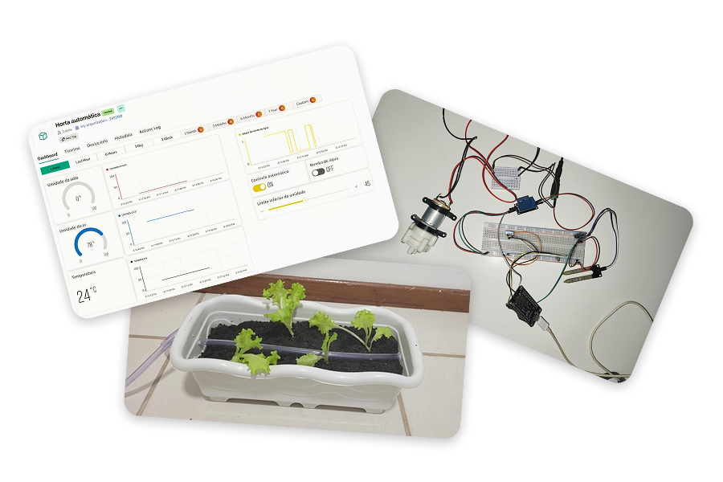

  🇺🇸 <strong>English</strong> | 🇧🇷 <a href="README.pt-br.md">Português</a>

# ✨ Welcome to My Portfolio!

Here you will find projects focused on embedded systems, IoT, real-time operating systems, and software development. Below is a guide to the main repositories you can explore.

## 📝 About me

I am a Computer Engineering student at the Federal University of Santa Catarina, expected to graduate in December 2026. I have a strong interest in programming and its integration with physical devices and hardware.

## 🚀 Featured Projects

<table>
<tr>
<td width="50%" valign="top">

### 🥊 [Wearable Device with TinyML for Punch Recognition in Combat Sports](https://github.com/lucaasporto/luva-combate-tinyml)

* This project is a wearable device capable of automatically identifying boxing punches using embedded Artificial Intelligence on an Arduino Nano 33 BLE Sense.
* The system reads accelerometer and gyroscope data to infer the moves and makes the results available via Bluetooth Low Energy (BLE) in real time.

  Technologies: C++ · Arduino Nano 33 BLE Sense · TinyML · Edge Impulse · BLE · IMU

</td>
<td width="50%" valign="middle">

</td>
</tr>
</table>

<table>
<tr>
<td width="50%" valign="top">

### 🧪 [Data Acquisition System for Low-Voltage Bioelectricity Measurement](https://github.com/lucaasporto/multimetro-12-canais)

* Low-cost and scalable continuous monitoring system for bioelectricity acquisition, specifically focused on microbial fuel cells.
* Powered by an ESP32, it reads 12 simultaneous channels in the millivolt scale and automatically sends the processed batches to a Google Sheets document via Wi-Fi.

  Technologies: C++ · ESP32 · ADS1115 · CD74HC4067 · I²C · Wi-Fi · Google Sheets API · Mongoose · EasyEDA

</td>
<td width="50%" valign="middle">

</td>
</tr>
</table>

<table>
<tr>
<td width="50%" valign="top">

### 🍽️ [Microwave Oven Simulator with FreeRTOS](https://github.com/lucaasporto/simulador-micro-ondas)

* An embedded application simulating a microwave oven to apply concepts of concurrent tasks, synchronization, queues, and interrupts.
* The system was developed using a PIC24FJ128GA010 microcontroller and the FreeRTOS real-time operating system, with the electronic circuit and execution fully simulated in Proteus.

  Technologies: C · PIC24FJ128GA010 · FreeRTOS · MPLAB · XC16 · Proteus

</td>
<td width="50%" valign="middle">

</td>
</tr>
</table>

<table>
<tr>
<td width="50%" valign="top">

### ♟️ [1D Smart Chessboard](https://github.com/lucaasporto/xadrez-1d)

* A physical, intelligent board for 1D Chess that automatically registers matches and transmits them via Bluetooth to a computer.
* It identifies the pieces using analog readings through resistors and integrates with a Python application built with Pygame to verify legal moves and record the game.

  Technologies: C++ · ESP32 · Python · Pygame · Bluetooth · I²C · Proteus

</td>
<td width="50%" valign="middle">

</td>
</tr>
</table>

<table>
<tr>
<td width="50%" valign="top">

### 🎟️ [Ticket Management Platform](https://github.com/lucaasporto/banco-de-dados-gestao-de-ingressos)

* A relational database system designed for a ticket sales platform, with a structured model for managing users, events, ticket batches, and sales-related data.
* Developed in Python with a MySQL connection, it covers the entire database lifecycle, including table creation, test data insertion, queries, and business rules for users, events, and lots.

  Technologies: Python 3 · MySQL

</td>
<td width="50%" valign="middle">

</td>
</tr>
</table>

<table>
<tr>
<td width="50%" valign="top">

### 🌱 [Automated Garden Irrigation System](https://github.com/lucaasporto/automated-garden-irrigation)

* An embedded system for automatic garden irrigation and environmental monitoring using an ESP8266, sensors, and Wi-Fi communication with the Blynk platform.
* The system continuously monitors temperature, air humidity, and soil moisture, automatically controlling a water pump when irrigation is required and allowing remote monitoring and manual control through a mobile application.

  Technologies: C++ · ESP8266 · Blynk · Wi-Fi · DHT11 · Soil Moisture Sensor · Relay Module · Water Pump

</td>
<td width="50%" valign="middle">

</td>
</tr>
</table>

---

*Feel free to explore the repositories for detailed documentation, circuit schematics, and source codes.*

## 📬 Let's Connect!

📧 **Email:** [lucaasportoasis@gmail.com](mailto:lucaasportoasis@gmail.com)  
💼 **LinkedIn:** [linkedin.com/in/lucasportoribeiro/](https://www.linkedin.com/in/lucasportoribeiro/)
