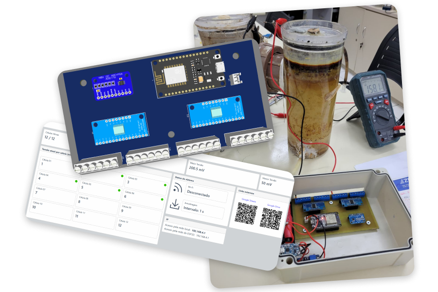
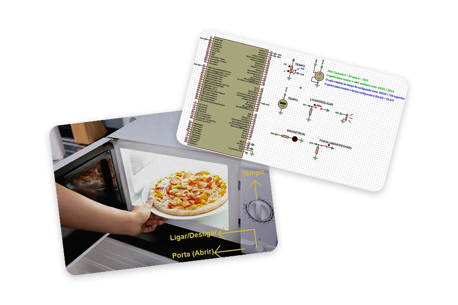
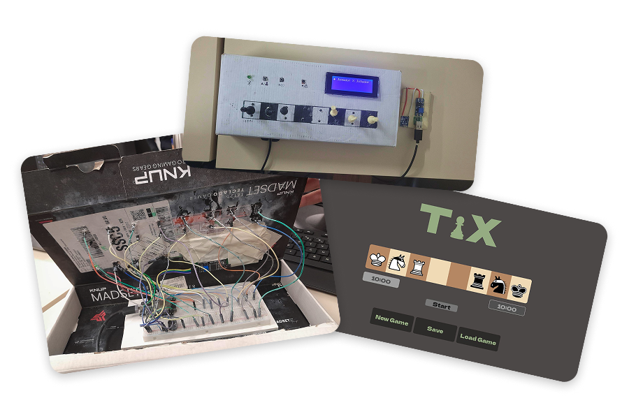
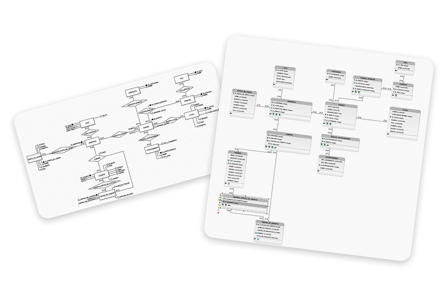

  🇺🇸 <a href="README.md">English</a> | 🇧🇷 <strong>Português</strong>

# ✨ Bem-vindo ao meu Portfólio!

Aqui você encontrará projetos focados em sistemas embarcados, IoT, sistemas operacionais de tempo real e desenvolvimento de software. Abaixo está um guia para os principais repositórios que você pode explorar.

## 📝 Sobre mim

Sou estudante de Engenharia de Computação na Universidade Federal de Santa Catarina, com previsão de formatura para dezembro de 2026. Tenho um forte interesse em programação e sua integração com dispositivos físicos e hardware.

## 🚀 Projetos em Destaque

<table>
<tr>
<td width="50%" valign="top">

### 🥊 [Dispositivo Vestível com TinyML para Reconhecimento de Golpes em Esportes de Combate](https://github.com/lucaasporto/luva-combate-tinyml)

* Este projeto é um dispositivo vestível capaz de identificar automaticamente golpes de boxe usando Inteligência Artificial embarcada em um Arduino Nano 33 BLE Sense.
* O sistema lê dados do acelerômetro e giroscópio para inferir os movimentos e disponibiliza os resultados via Bluetooth Low Energy (BLE) em tempo real.

  Tecnologias: C++ · Arduino Nano 33 BLE Sense · TinyML · Edge Impulse · BLE · IMU

</td>
<td width="50%" valign="middle">

</td>
</tr>
</table>

<table>
<tr>
<td width="50%" valign="top">

### 🧪 [Sistema de Aquisição de Dados para Medição de Bioeletricidade em Baixa Tensão](https://github.com/lucaasporto/multimetro-12-canais)

* Sistema de monitoramento contínuo escalável e de baixo custo para aquisição de bioeletricidade, focado especificamente em células a combustível microbianas.
* Alimentado por um ESP32, ele lê 12 canais simultâneos na escala de milivolts e envia automaticamente os lotes processados para um documento do Google Sheets via Wi-Fi.

  Tecnologias: C++ · ESP32 · ADS1115 · CD74HC4067 · I²C · Wi-Fi · Google Sheets API · Mongoose · EasyEDA

</td>
<td width="50%" valign="middle">

</td>
</tr>
</table>

<table>
<tr>
<td width="50%" valign="top">

### 🍽️ [Simulador de Forno de Micro-ondas com FreeRTOS](https://github.com/lucaasporto/simulador-micro-ondas)

* Uma aplicação embarcada simulando um forno de micro-ondas para aplicar conceitos de tarefas concorrentes, sincronização, filas e interrupções.
* O sistema foi desenvolvido utilizando um microcontrolador PIC24FJ128GA010 e o sistema operacional de tempo real FreeRTOS, com o circuito eletrônico e execução totalmente simulados no Proteus.

  Tecnologias: C · PIC24FJ128GA010 · FreeRTOS · MPLAB · XC16 · Proteus

</td>
<td width="50%" valign="middle">

</td>
</tr>
</table>

<table>
<tr>
<td width="50%" valign="top">

### ♟️ [Tabuleiro Inteligente de Xadrez 1D](https://github.com/lucaasporto/xadrez-1d)

* Tabuleiro físico e inteligente para Xadrez 1D que registra automaticamente as partidas e as transmite via Bluetooth para um computador.
* Ele identifica as peças usando leituras analógicas através de resistores e integra-se com uma aplicação Python construída com Pygame para verificar movimentos legais e registrar o jogo.

  Tecnologias: C/C++ · ESP32 · Python · Pygame · Bluetooth · Proteus

</td>
<td width="50%" valign="middle">

</td>
</tr>
</table>

<table>
<tr>
<td width="50%" valign="top">

### 🎟️ [Plataforma de Gerenciamento de Ingressos](https://github.com/lucaasporto/banco-de-dados-gestao-de-ingressos)

* Um sistema de banco de dados relacional projetado para uma plataforma de venda de ingressos, com um modelo estruturado para gerenciar usuários, eventos, lotes de ingressos e dados relacionados às vendas.
* Desenvolvido em Python com MySQL, o projeto cobre todo o ciclo de vida do banco de dados, incluindo modelagem relacional, criação de tabelas, inserção de dados de teste, consultas e regras de negócio para garantir a consistência dos dados.

  Tecnologias: Python 3 · MySQL

</td>
<td width="50%" valign="middle">

</td>
</tr>
</table>

---

*Fique à vontade para explorar os repositórios para obter documentação detalhada, esquemas de circuitos e códigos-fonte.*

## 📬 Vamos nos Conectar!

📧 **Email:** [lucaasportoasis@gmail.com](mailto:lucaasportoasis@gmail.com)  
💼 **LinkedIn:** [linkedin.com/in/lucasportoribeiro/](https://www.linkedin.com/in/lucasportoribeiro/)
