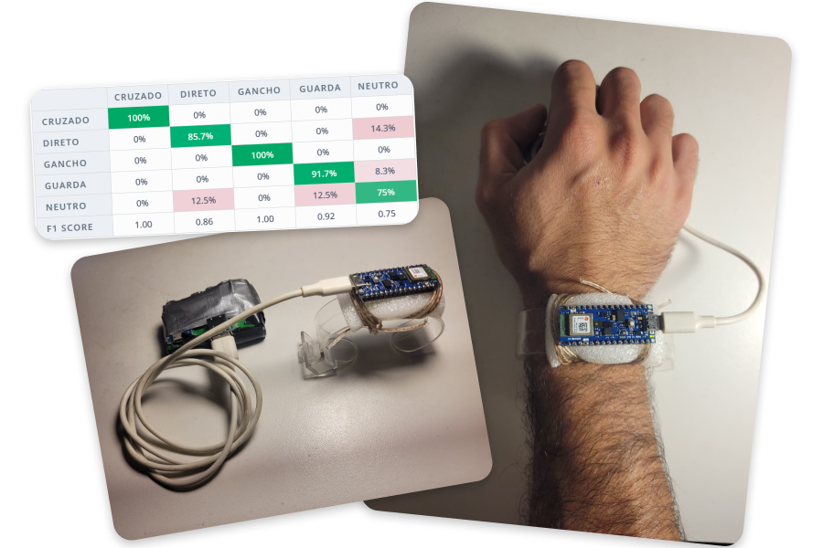

<table>
<tr>
<td width="55%" valign="top">

### 🥊 [Wearable Device with TinyML for Punch Recognition in Combat Sports](https://github.com/lucaasporto/luva-combate-tinyml)

* This project is a wearable device capable of automatically identifying boxing punches using embedded Artificial Intelligence on an Arduino Nano 33 BLE Sense.
* The system reads accelerometer and gyroscope data to infer the moves and makes the results available via Bluetooth Low Energy (BLE) in real time.

</td>
<td width="45%" valign="middle">

</td>
</tr>
</table>
